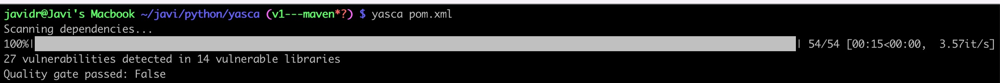
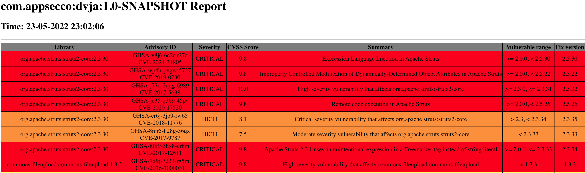

# Yasca

Yasca (Yet Another SCA) tool - or just Yasca, is an opensource SCA tool written in Python. It is relies on Github advisories to detect vulnerabilities in the libraries.

In this first release, it only works with Java projects built with Maven, but there are plans to expand it to Gradle,

## How does it work

Yasca is written in python, and therefore the CLI can be installed with pip

`pip install yasca`

It can also be used as a github action, or as a [docker image](https://hub.docker.com/repository/docker/javidr/yasca)

Yasca requires an input file (pom.xml) to perform the scan. It builds the dependency tree from that file, and then, queries Github Advisories to search for vulnerabilities in the libraries.Because of this, a github token needs to be set as environental variable under GITHUB_TOKEN.


export GITHUB_TOKEN=YOUR_TOKEN

Once the scan is finished, it generates an html report called sca_report.html, with the issues found, and prints in the console a summary of the scan








Yasca has some optional functionalities that can be enabled through a flag:

**--sbom**: **True**/False. This flag is set to true by default. If it is enabled, it generates a cyclonedx SBOM file called cyclonedx_report.json

**--include_dev**: True/**False**. By default it is set to false, which means the tool will not scan dev dependencies

**--quality_gate**: OFF/**LOW**/MEDIUM/HIGH/CRITICAL. Set to LOW by default, this is the maximum level of severity allowed. The tool returns an error if there are vulnerabilities with a severity equal or bigger to the quality gate.

**--suppression_file**: Yasca will ignore the vulnerabilities included in the file sent as parameter with this flag. The suppression file is a json that needs to include the vulnerability to ignore (CVE or GHSA) and the package where the vulnerability will be ignored, as for example:

```
[
  {
    "vulnerability": "CVE-2022-22965",
    "package": "org.springframework.boot:spring-boot-starter-web:1.2.1.RELEASE"
  },
    {
    "vulnerability": "CVE-2019-0199",
    "package": "org.apache.tomcat.embed:tomcat-embed-core:8.0.15"
  }
]
```


## Github action

Yasca works perfectly in github workflows, and in fact it was designed to be a github action! Here is the interface for the action, with all the available parameters:


    file:
        required: true
    sbom:
        required: false
        default: True
    include_dev:
        required: false
        default: False
    quality_gate:
        required: false
        default: "LOW"
    suppression_file:
        required: false


The action requires the github token as an env variable. This token already exists in github repositories, so you just need to set it inside the action as follows:

    env:
      GITHUB_TOKEN: ${{ secrets.GITHUB_TOKEN }} 


## Github action - Example

Here is an example of how to use the action in a workflow:

    name: Yasca test
    
    on: push
    jobs:
      build:
        runs-on: ubuntu-latest
        steps:
          - name: Checkout Code
            uses: actions/checkout@v3
            
          - name: yascatest
            uses: javixeneize/yasca@main
            with:
              file: pom.xml
            env:
              GITHUB_TOKEN: ${{ secrets.GITHUB_TOKEN }}
              
          - uses: actions/upload-artifact@v3
            if: always()
            with:
              name: html_report
              path: sca_report.html
          - uses: actions/upload-artifact@v3
            if: always()
            with:
              name: cycloneDx_report
              path: cyclonedx_report.json  
Note that If the quality gate is not matched, it will break the workflow, so you will need to use if: always() syntax to save the reports. 


## Roadmap

- [ ] Generate sarif report
- [ ] Improve CycloneDX report to include vulnerabilities
- [ ] Support NodeJS
- [ ] Support Gradle